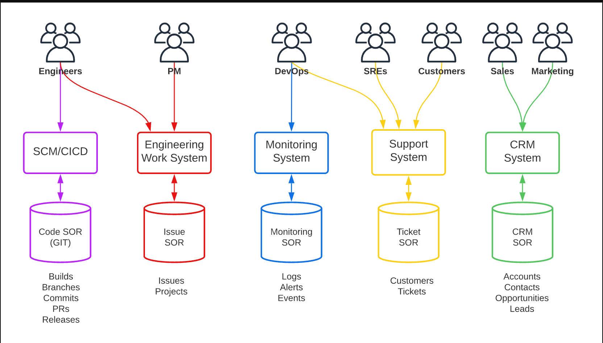
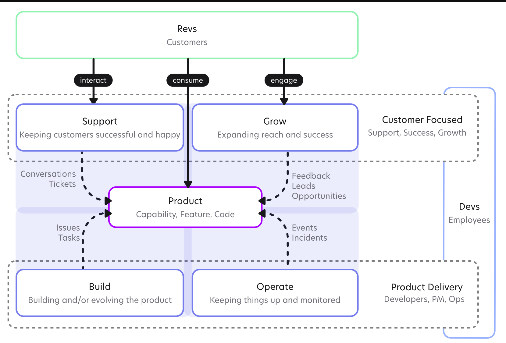

## The problem

Whether by design or misfortune, companies are often biased toward creating silos. For example, as they grow they add new departments, new departments and new leaders commonly bring their own systems of record, and those departments can grow to need their “own space”.

The following figure shows a sample of the various teams/systems you commonly see:

In this model each “team” has their own systems and accounts are commonly not shared across teams either due to license constraints, the preference to work in their “console”, lack of knowledge, or plain not knowing any better. These systems commonly have little to no integration, leading to duplication, inconsistency and lack of coordination across teams given they all see things differently.

## Shared pain

The founders of Datum all have years of shared experiences within large enterprises; We felt the pain of engineering not having access to the support system and context from customer discussions. We felt the pain of product management not having all the context to define and prioritize clearly. We felt the pain of sales reps not having clarity on their customers’ tickets, engineering roadmaps, and the status of items relevant to them. We felt the pain of support not having access to information like customer details and the status of pipeline opportunities. Lastly, we felt the pain of having to ‘ask’ for access or context instead of natively having it in the context of the work.

Perturbed by this inefficiency and understanding the impact this had on ourselves and others alike, we had enough and knew there had to be a better way, hence the beginnings of what led to Datum.

## Starting from Zero

At our previous company (including our current), we went through all of the phases from the initial ideation of the product and founding of the company, its design, and prototyping, getting something working in the hands of customers and eventually scaling the product and company.

In retrospect, four core phases of this lifecycle, or fundamental tenants, became apparent:

- Build
- Operate
- Support
- Grow

At a high-level something similar to the following figure:

## Breaking down silos

Silos are bad for most businesses; this is not an unknown thing. However, by enabling everyone to have the same context, we can enable everyone to work in unison towards a common goal; driving a much more efficient and productive experience for all.

In that vein, our goal isn’t to sell products. Instead, it is to **enable people to build, operate, support and grow products more effectively.**