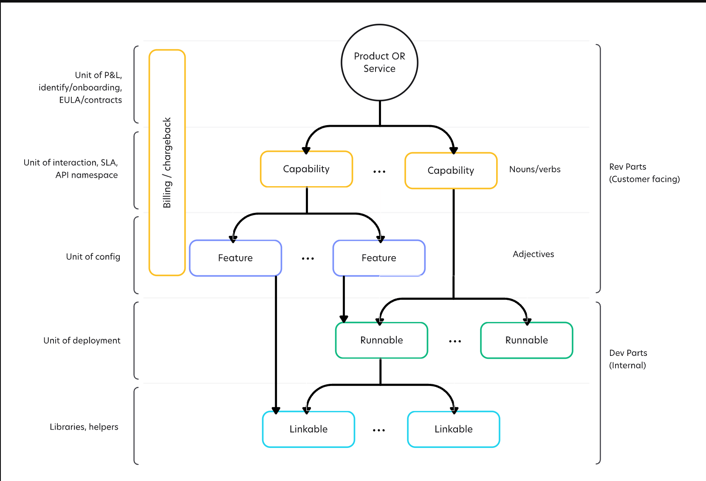

As we rationalize and think about the product we want to build at Datum, we want to tie everything back to a product or a piece of a product. At a macro level this can be characterized into two core areas:

- Parts the customer interacts with
- Parts which provide functionality

Products typically have the following characteristics:

- Are a unit of profit and loss (P&L)
- Are where customers (internal or external) are onboarded
- Provide the basis for identity
- May have a notion of billing/chargeback (which can be done at this level or further down the stack)

Services may have the following additional characteristics:

- Provide an API or interface
- Define code-based or business services
- One example of the difference between a product and a service is Microsoft Office (software product) versus Office 365 (cloud service).

A key to consider is that all must be considered in the perspective of the dev org. A product for them may be a service for another. For example, consider a managed services provider, they may provide a “product” (e.g. Microsoft Exchange) delivered as a managed service.

A service may also be a business service like IT (internal), HR (internal) or Consulting (external.)

Example products delivered as software or tangible goods:

- Hardware products (Lenovo laptops, etc.)
- Software products (MSFT Office, Acrobat, etc.)

Example services:

- Cloud services (Amazon Web Services, Azure, GCP)
- IT services (Helpdesk, Data center, etc.)
- Facilities services (building services, lunch services)

## High level grouping

This wiki is organized around a rough product structure such that we've lumped each of our products into a "category" - those categories being:

- Digital Infrastructure
- GTM (Go To Market)
- Sustainability

Under each of those categories we have individual products, and those products are grouped by Now, Next, Later, Some day - this is intended to result in a high level road map of sorts which we can then translate into tangible work streams with sub-parts.